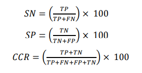

# Cepstrum Coefficients Based Sleep Stage Classification
Lucas Rigo Tofoli - 20211ceca0382

```
@article{oral2017cepstrum,
  title={Cepstrum coefficients based sleep stage classification},
  author={Oral, E Argun and Ozbek, I Yucel and {\c{C}}odur, M Mustafa},
  booktitle={2017 IEEE Global Conference on Signal and Information Processing (GlobalSIP)},
  pages={457--461},
  year={2017},
  organization={IEEE}
}
```

## Do que se trata
Esse artigo faz um estudo do coeficiente cepstrum discriminativo dos sinais de EEG para classificação dos estágios do sono, utilizando o Support Vector Machine (SVM). Sendo os 3 estágios do sono, "Wake", "REM" e "NREM".

### Extração de características

Os coeficientes de cepstrum são extraídos para formar um vetor de características para remover a redundância nos sinais de EEG. E então a extração segue os seguintes passos:

- As gravações do sinal de EEG são divididas em quadros de 30 segundos, e cada quadro é multiplicado por uma janela função para formar uma época.

- DFT (Discrete Fourier Transform) das épocas são calculadas e seu valor absoluto é alimentado para um conjunto de filtros com escala de frequência, assim capturando uma banda de frequência predefinida.

- Cada saída dos filtros é somada à frequência, e o logaritmo correspondente é calculado para obter a quantidade de energia das bandas para as quais o filtro é projetado.

- E então a DCT (Discrete Cosine Transform) dos valores de espectro do logaritmo são calculados para voltar ao domínio do tempo. Resultando nos coeficientes cepstrum para formar o vetor de características.

### Classificação

Para realizar a classificação dos estágios do sono, é utilizado o Support Vector Machine (SVM), que assim como escrito anteriormente ele é um método de classificação onde um conjunto de dados de treinamento representando duas classes diferentes, é projetada em um alto espaço dimensional. No caso desse estudo, não é possível separar linearmente os dados do treinamento, por isso o modelo do SVM pode ser mapeado para um espaço dimensional maior através da função de Kernel, criando assim um hiperplano no domínio transformado. O método utilizado para fazer a comparação e assim classificar foi o um contra um.

### Resultados

Neste estudo, os coeficientes cepstrum são considerados como características do sinal EEG. Já os filtros (triangular, Hamming e Hanning), normalização do filtro, escala de frequência, energia das épocas e derivadas de primeira e segunda ordem dos coeficientes são considerados como parâmetros de extração de características, melhorando assim a atuação do classificador.

A partir disso, observou-se que a melhor taxa de classificação é obtida para coeficientes cepstrum linear, utilizando banco de filtros Hamming normalizado e quando as características são aumentados com energia, coeficiente cepstrum de ordem zero e termos derivados, sendo assim  tendo como resultado uma precisão de 95.58%.

### Como funciona os cálculos para classificação dos estágios do sono

A classificação é dividida em três estágios do sono, denominados 'wake', 'REM' e 'NREM'. Quatro diferentes possibilidades podem ocorrer no teste de uma época, sendo essas o True Positive (TP), o False Negative (FN), o False Positive (FP) e o True Negative (TN). Baseado nisso, o Sensitivity (SN), Specificity (SP) e o Correct Classification Ratio (CCR) são calculados da seguinte forma:



O CCR calculado determina a acurácia e com objetivo de obter o maior CCR possível foi determinado um filtro que resultasse na melhor classificação, nesse caso para as escalas 'Linear' (LFCC) e 'Mel' (MFCC) foi utilizado o filtro Triangular, porém mesmo que ambas as funções tenham apresentado resultados muito similares, quando adicionados os recursos de energia da época, coeficiente de ordem zero e as derivadas de primeira e segunda ordem do coeficiente cepstrum (LFCC or MFCC + 0 + E + Δ + ΔΔ) , o LFCC (95.39%) apresentou um resultado melhor do que o MFCC (95.28%).

O estudo também foi feito utilizando os filtros de Hamming e Hanning e ao fazer o cálculo utilizando todos esses filtros e suas versões normalizadas, o melhor resultado foi encontrado em 'LFCC + 0 + E + Δ + ΔΔ + Hanning + Normalize + SVM', com uma acurácia de 95.58%.
